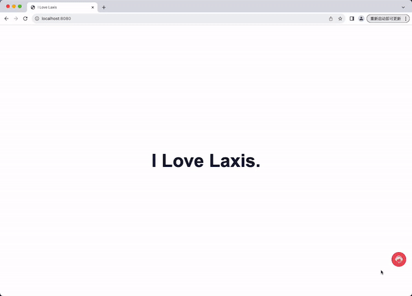

## Table of Contents

- [Background](#background)
- [Install](#install)
- [Usage](#usage)
- [Demo](#demo)
- [Functionality](#functionality)
- [Maintainers](#maintainers)

## Background

This project involves developing a chatbot widget that can be embedded into web
pages. The widget will serve as an interactive tool for website visitors, allowing them to
engage in a basic conversation with the bot. 

## Install

This project uses [node](http://nodejs.org) and [npm](https://npmjs.com). Go check them out if you don't have them locally installed.

```sh
$ npm install
```

## Usage

To start the service, run the following command:

```sh
$ npm run start
```

Once started, the service will run at http://localhost:8080.

## Demo
Demo Image 


## Functionality

The chatbot widget offers the following features:

- Clicking the customer service button on the right side opens the chat window.
- The chat window provides options for common questions. Clicking on these options allows users to ask questions quickly.
- The customer service will respond after a short delay.
- Hovering over the chat bubbles displays the time of the sent message.
- Users can send messages by pressing Enter or clicking the send button in the input box.


## Maintainers

This project is maintained by[@Xinyu](https://github.com/chenxinyu2018).

